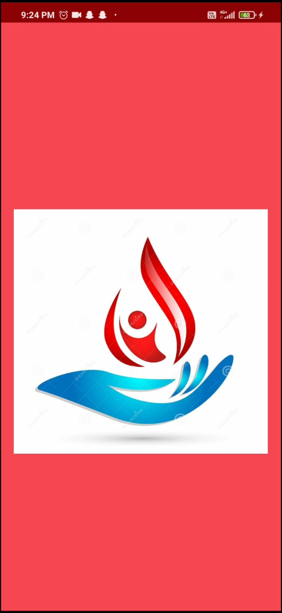
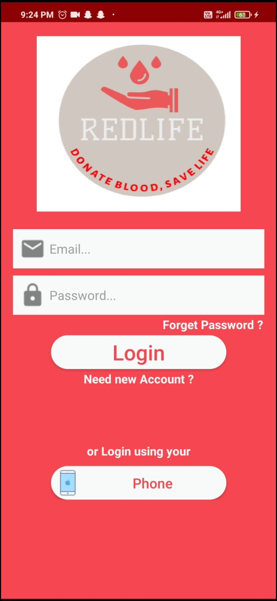
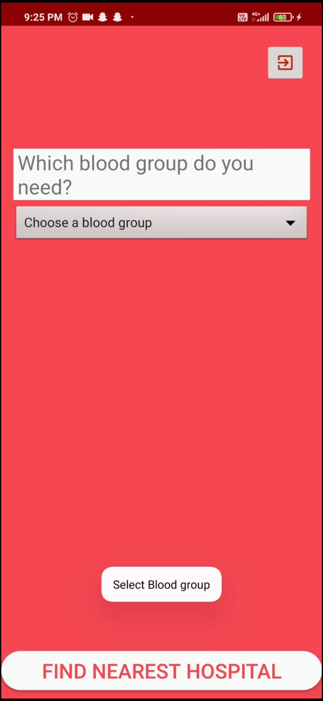
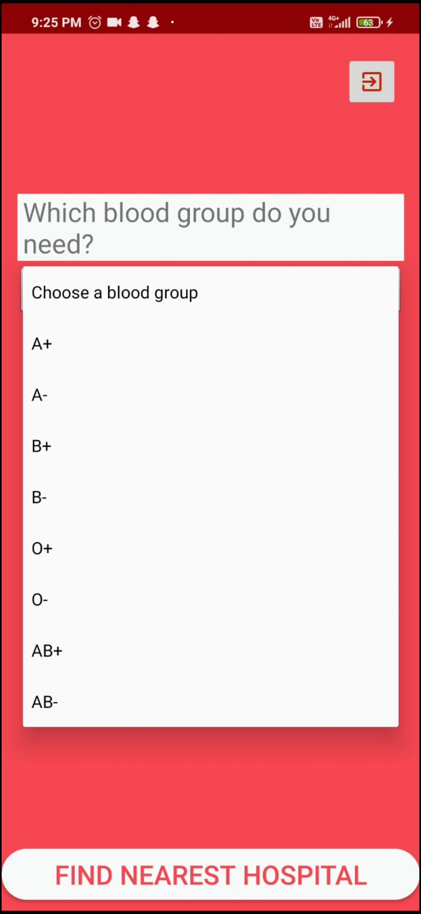
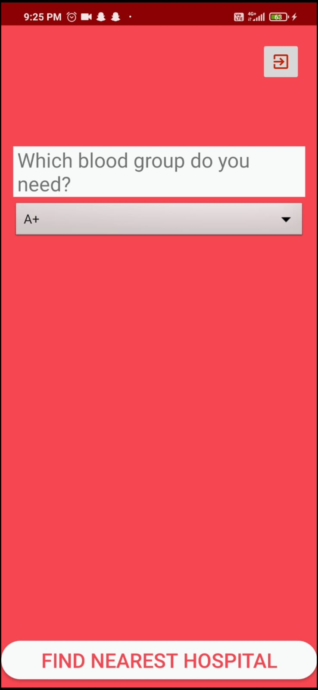
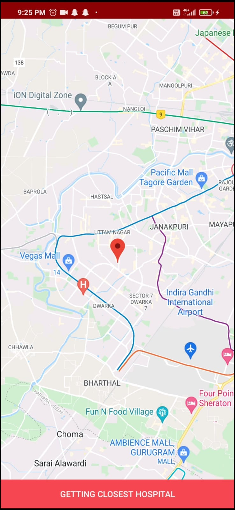
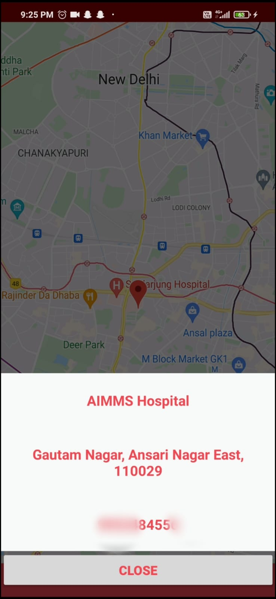

# REDLIFE
About
“RedLife” is an android application to find nearest hospital for blood. Users who have an android phone & active internet connection can contact and start searching for a nearest hospital easily through this application.

# Features
You can find the nearest hospital for blood through this android application.
Included:
- User Databases
- User Login & Sign up (Via email /phone number)
- Finding Near By Hospitals
- Getting info of hospital
# Tools used
+ Firebase Database
+ Firebase Authentication
+ Google Maps Api
+ Android Studio IDE
+ Android SDK 19-29
# Preview:

